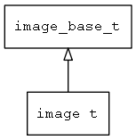

## image\_t
### 概述


 图片控件。

 用来显示一张静态图片，目前支持bmp/png/jpg等格式。

 如果要显示gif文件，请用[gif\_image](gif_image_t.md)。

 如果要显示svg文件，请用[svg\_image](svg_image_t.md)。

 如果需要支持勾选效果，请设置**selectable**属性。

 如果需要支持点击效果，请设置**clickable**属性。

 image\_t是[image\_base\_t](image_base_t.md)的子类控件，image\_base\_t的函数均适用于image\_t控件。

 在xml中使用"image"标签创建图片控件。如：

 ```xml
 <image style="border" image="earth" draw_type="icon" />
 ```

 > 更多用法请参考：
 [image.xml](https://github.com/zlgopen/awtk/blob/master/demos/assets/raw/ui/images.xml)

 在c代码中使用函数image\_create创建图片控件。如：

 ```c
  widget_t* image = image_create(win, 10, 10, 128, 30);
  image_set_image(image, "earth");
 ```

 > 创建之后:
 >
 > 需要用widget\_set\_image设置图片名称。
 >
 > 可以用image\_set\_draw\_type设置图片的绘制方式。

 > 绘制方式请参考[image\_draw\_type\_t](image_draw_type_t.md)

 > 绘制方式的属性值和枚举值:
 [image\_draw\_type\_name\_value](https://github.com/zlgopen/awtk/blob/master/src/base/enums.c#L98)

 > 完整示例请参考：
 [image demo](https://github.com/zlgopen/awtk-c-demos/blob/master/demos/image.c)

 可用通过style来设置控件的显示风格，如背景和边框等。如：

 ```xml
 <image>
  <style name="border">
   <normal border_color="#000000" bg_color="#e0e0e0" text_color="black"/>
  </style>
 </image>
 ```

 > 更多用法请参考：
 [theme
 default](https://github.com/zlgopen/awtk/blob/master/demos/assets/raw/styles/default.xml#L313)


----------------------------------
### 函数
<p id="image_t_methods">

| 函数名称 | 说明 | 
| -------- | ------------ | 
| <a href="#image_t_image_cast">image\_cast</a> | 转换为image对象(供脚本语言使用)。 |
| <a href="#image_t_image_create">image\_create</a> | 创建image对象 |
| <a href="#image_t_image_set_draw_type">image\_set\_draw\_type</a> | 设置图片的绘制方式。 |
### 属性
<p id="image_t_properties">

| 属性名称 | 类型 | 说明 | 
| -------- | ----- | ------------ | 
| <a href="#image_t_draw_type">draw\_type</a> | image\_draw\_type\_t | 图片的绘制方式(仅在没有旋转和缩放时生效)。 |
#### image\_cast 函数
-----------------------

* 函数功能：

> <p id="image_t_image_cast"> 转换为image对象(供脚本语言使用)。


* 函数原型：

```
widget_t* image_cast (widget_t* widget);
```

* 参数说明：

| 参数 | 类型 | 说明 |
| -------- | ----- | --------- |
| 返回值 | widget\_t* | image对象。 |
| widget | widget\_t* | image对象。 |
#### image\_create 函数
-----------------------

* 函数功能：

> <p id="image_t_image_create"> 创建image对象


* 函数原型：

```
widget_t* image_create (widget_t* parent, xy_t x, xy_t y, wh_t w, wh_t h);
```

* 参数说明：

| 参数 | 类型 | 说明 |
| -------- | ----- | --------- |
| 返回值 | widget\_t* | 对象。 |
| parent | widget\_t* | 父控件 |
| x | xy\_t | x坐标 |
| y | xy\_t | y坐标 |
| w | wh\_t | 宽度 |
| h | wh\_t | 高度 |
#### image\_set\_draw\_type 函数
-----------------------

* 函数功能：

> <p id="image_t_image_set_draw_type"> 设置图片的绘制方式。


* 函数原型：

```
ret_t image_set_draw_type (widget_t* widget, image_draw_type_t draw_type);
```

* 参数说明：

| 参数 | 类型 | 说明 |
| -------- | ----- | --------- |
| 返回值 | ret\_t | 返回RET\_OK表示成功，否则表示失败。 |
| widget | widget\_t* | image对象。 |
| draw\_type | image\_draw\_type\_t | 绘制方式(仅在没有旋转和缩放时生效)。 |
#### draw\_type 属性
-----------------------
> <p id="image_t_draw_type"> 图片的绘制方式(仅在没有旋转和缩放时生效)。


* 类型：image\_draw\_type\_t

| 特性 | 是否支持 |
| -------- | ----- |
| 可直接读取 | 是 |
| 可直接修改 | 否 |
| 可持久化   | 是 |
| 可脚本化   | 是 |
| 可在IDE中设置 | 是 |
| 可在XML中设置 | 是 |
| 可通过widget\_get\_prop读取 | 是 |
| 可通过widget\_set\_prop修改 | 是 |
